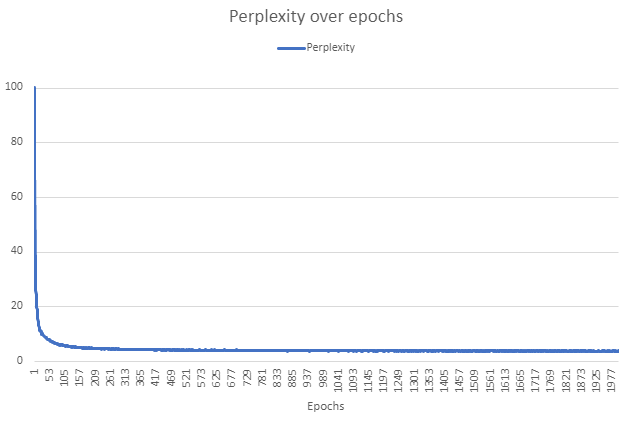

# Perplexity

# Output
## Ligma
Ligmance was nothing;
And they sent a fame against thy justice,
As you swear charity, but enjoy, lord rem

## berty
berty.

ANTIGONUS:
I say. I can never repent fair provised;
And do that, let me now hard it, thou art so

## things
things thousand being the port;
Bid me for live. Will I you tell the law, good lord,
And thou prove him an
## The
The valours, you have stock how that
The life now and traitor's moving cause for every brother
To the f
## What is
What is the least; so thy sister thee,
Or love thee a prys, is my life to yog love,
Fellow the reposed the
## Shall I give
Shall I give me dinder joyful meant
With tell me my faith to thy drinks some age,
And bring to me to me and love
## X087hNYB BHN BYFVuhsdbs
X087hNYB BHN BYFVuhsdbs:
So let the fine change figue to slon more keep'st,
When the treased on the time the prepared,
And
