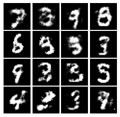
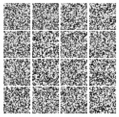
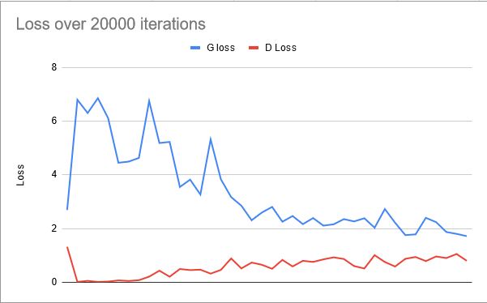
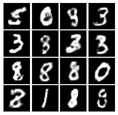
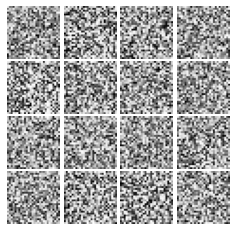
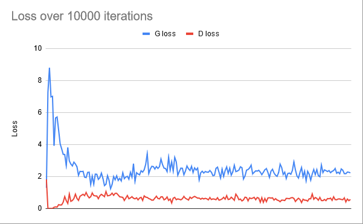

# Task 1

## 20k

## 100k

## GAN improvments

From [Soumith Chintala 2016](https://www.youtube.com/watch?v=myGAju4L7O8)

- Nomalize inputs between -1, 1 and use tanh as output layer in generator
- Modify loss function max log D instead of min log 1-D
- Use spherical noise vector 
- Don't mix generated data with real data (batch norm)
- Avoid sparse gradients, replace relu and maxpool with leakyrelu and average pooling for example
- Label smoothing, predict with probabilities of being in class
- Use DCGANs when able to
